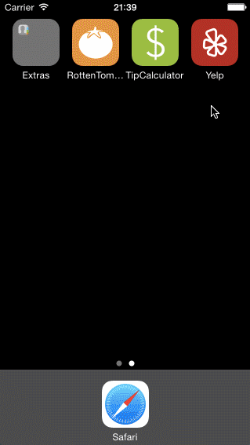

# CodePath iOS Week 2: Yelp Lite

Time spent: 20 hours spent in total

Completed user stories:

Search results page
* [x] Required: Table rows should be dynamic height according to the content height
* [x] Required: Custom cells should have the proper Auto Layout constraints
* [x] Required: Search bar should be in the navigation bar (doesn't have to expand to show location like the real Yelp app does).
* [x] Optional: infinite scroll for restaurant results
* [x] Optional: Implement map view of restaurant results

Filter page
* [x] Required: The filters you should actually have are: category, sort (best match, distance, highest rated), radius (meters), deals (on/off).
* [x] Required: The filters table should be organized into sections as in the mock.
* [x] Required: You can use the default UISwitch for on/off states. 
* [ ] Optional: implement a custom switch
* [x] Required: Radius filter should expand as in the real Yelp app
* [x] Required: Categories should show a subset of the full list with a "See All" row to expand. 
* [x] Clicking on the "Search" button should dismiss the filters page and trigger the search w/ the new filter settings.

* [ ] Optional: Implement the restaurant detail page.

Additonal things I tried to experiment with:
* Custom navigation bar buttons to match Yelp's style
* Custom annotation markers in map view to match Yelp's style

Questions and Known Issues:
* On the filter page, the open/expand dropdown animation is a bit weird. I couldn't figure out how to make it smooth like Yelp's.
* After tapping "Search" and returning back to the main page, the old results still show up briefly before the new search is kicked off. Not sure how to hide it completely.

Video Walkthroughs:

